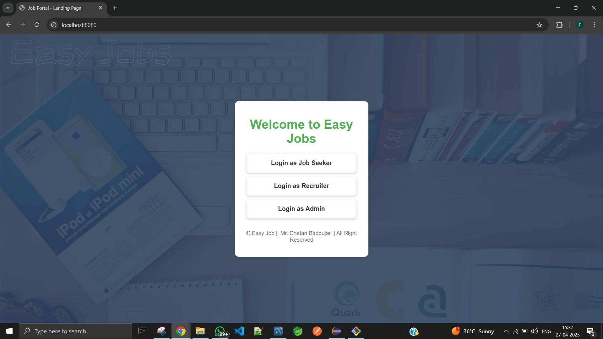
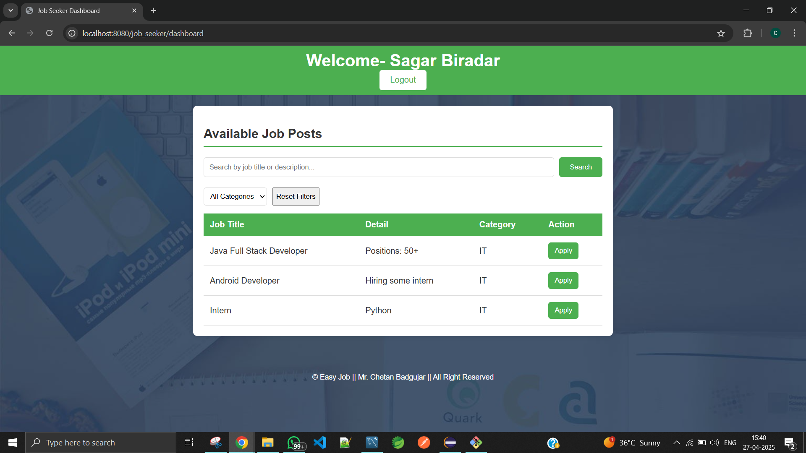
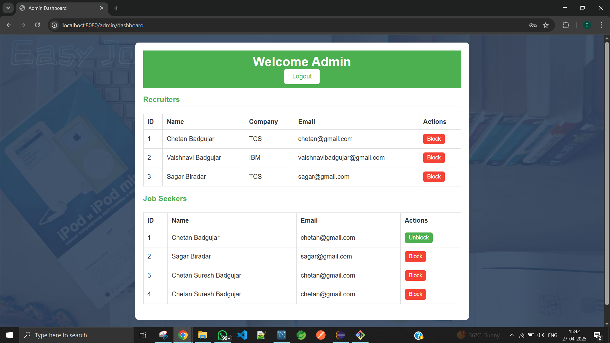

# EasyJob Project

**EasyJob** is a full-stack web application designed to streamline the job search and recruitment process. Built using **Spring Boot** for the backend and **Angular** for the frontend, the project offers an efficient, scalable, and modern solution for managing job listings, applications, and user interactions.

----

## 🚀 Tech Stack Used

### 🔧 Backend
- **Spring Boot** – Java-based backend framework
- **MySQL** – Relational database
- **Postman** – API testing and documentation tool

### 🎨 Frontend
- **Angular** – TypeScript-based frontend framework
- **HTML5** – Markup language
- **CSS3** – Styling
- **JavaScript** – Client-side scripting
- **TypeScript** – Enhanced JavaScript used in Angular
- **JSON** – Data format for API communication

----

## 📁 Project Output

### 1 Welcome Page

### 2 Job Posts

### 3 Admin-[Recruiters + Job Seekers]

